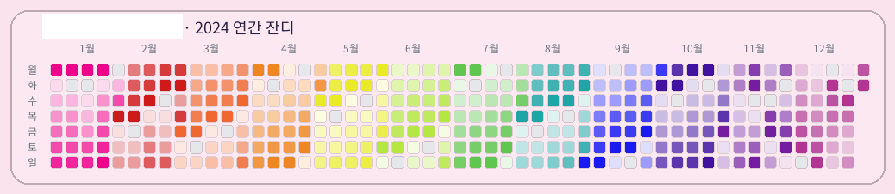
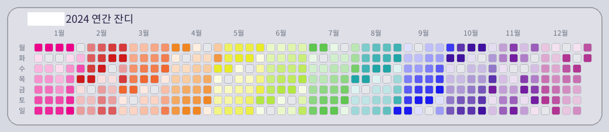
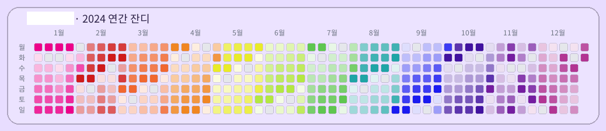
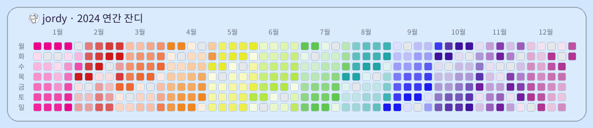

# 🎓 마법사관학교 학습 트래커 봇

> 디스코드 공부서버인 "마법사관학교"에서 학습 시간을 자동으로 기록하고, 아름다운 학생증과 잔디 캘린더로 성장을 시각화하는 봇

## 📖 소개

**마법사관학교 학습 트래커 봇**은 디스코드 음성 채널에서의 학습 시간을 자동으로 추적하고, 게임처럼 재미있는 레벨 시스템과 시각적 보상으로 학습 동기를 높여주는 봇입니다.

조용한 공부방, 스터디 그룹, 학습 커뮤니티에서 멤버들의 꾸준한 참여를 독려하고, 객관적인 학습 데이터를 제공한다.

## ✨ 주요 특징

### 🎴 학생증 프로필 카드
- **개인화된 학생증**: 디스코드 프로필 이미지, 닉네임, 학번이 담긴 나만의 학생증
- **실시간 통계**: 오늘/주/월/누적 학습 시간을 한눈에 확인
- **레벨 & XP 시스템**: 학습할수록 성장하는 RPG 스타일 레벨업 시스템
- **기숙사 소속**: 서버 역할 기반 기숙사 배정 (소용돌이, 펭도리야, 노블레빗, 볼리베어)
- **월간 캘린더**: 이번 달 학습 참여 현황을 달력으로 시각화

### 🌱 연간 잔디 캘린더
- **GitHub 스타일 히트맵**: 1년간의 학습 활동을 깃허브 잔디처럼 시각화
- **일일 학습량 추적**: 매일매일의 학습 시간을 색상 강도로 표현
- **동기부여 도구**: 빈틈없이 채워진 잔디는 최고의 성취감

### 🏆 게이미피케이션 요소
- **자동 시간 기록**: 음성 채널 입장만 하면 자동으로 학습 시간 측정
- **레벨 시스템**: 1시간 = 1XP, 단계별로 필요 경험치가 증가하는 10단계 레벨 시스템
- **스트릭 추적**: 연속 학습일수를 기록하여 꾸준함을 보상
- **장학생 배지**: 특별한 역할을 가진 멤버에게 표시되는 특별 아이콘

### 🎯 서버 운영진을 위한 기능
- **기숙사장 권한**: 특정 역할을 가진 멤버는 다른 사용자의 프로필 조회 가능
- **자동 학번 생성**: 서버 가입일 기반으로 학번 자동 부여
- **학년 시스템**: 가입 기간에 따라 자동으로 학년이 올라감 (1년 = 1학년 상승)
- **데이터 기반 관리**: 객관적인 활동 데이터로 멤버 관리 용이

## 🖼️ 학생증 예시

각 기숙사별로 고유한 테마 색상이 적용된 학생증을 확인해보세요:

<table>
  <tr>
    <td align="center" width="50%">
      
      <br/>
      <b>🦋 소용돌이</b>
    </td>
    <td align="center" width="50%">
      
      <br/>
      <b>🐧 펭도리야</b>
    </td>
  </tr>
  <tr>
    <td align="center" width="50%">
      
      <br/>
      <b>🐰 노블래빗</b>
    </td>
    <td align="center" width="50%">
      
      <br/>
      <b>🐻‍❄️ 볼리베어</b>
    </td>
  </tr>
</table>

각 학생증에는 **프로필 이미지, 이름, 학번, 기숙사, 학년, 레벨, XP 진행도, 오늘/주/월/누적 학습시간, 월간 출석 캘린더**가 포함됩니다.

## 🌱 잔디 예시

GitHub 스타일의 연간 학습 활동 히트맵으로 꾸준함을 시각화하세요:

<table>
  <tr>
    <td align="center" width="50%">
      
      <br/>
      <b>🦋 소용돌이</b>
    </td>
    <td align="center" width="50%">
      
      <br/>
      <b>🐧 펭도리야</b>
    </td>
  </tr>
  <tr>
    <td align="center" width="50%">
      
      <br/>
      <b>🐰 노블래빗</b>
    </td>
    <td align="center" width="50%">
      
      <br/>
      <b>🐻‍❄️ 볼리베어</b>
    </td>
  </tr>
</table>

잔디 캘린더는 **1년간의 일일 학습 시간을 색상 강도로 표현**하여, 꾸준한 학습 습관을 한눈에 확인할 수 있습니다.

## 🎮 사용 방법

### `/학생증` - 나의 학생증 확인하기
```
/학생증
```
본인의 학생증 프로필 카드를 생성합니다. 학습 시간, 레벨, 월간 활동 현황을 확인할 수 있습니다.

**기숙사장 전용 기능:**
```
/학생증 @사용자
```
특정 멤버의 학생증을 조회할 수 있습니다. (기숙사장 역할 필요)

### `/잔디` - 연간 학습 잔디 보기
```
/잔디
```
올해의 학습 활동을 깃허브 스타일 잔디 캘린더로 확인합니다.

**옵션:**
```
/잔디 연도:2024
/잔디 @사용자
/잔디 연도:2024 @사용자
```
- 특정 연도의 잔디를 조회하거나
- 다른 사용자의 잔디를 조회할 수 있습니다 (기숙사장 권한 필요)

## 🏫 마법사관학교 컨셉

이 봇은 해리포터의 호그와트 마법학교에서 영감을 받은 "마법사관학교" 테마를 사용합니다:

- **기숙사 시스템**: 4개의 기숙사 (소용돌이, 펭도리야, 노블레빗, 볼리베어)
- **학년 시스템**: 가입 기간에 따라 1학년부터 시작
- **학번**: 가입일 기반 고유 학번 자동 부여
- **기숙사장**: 각 기숙사를 관리하는 특별 권한 역할
- **장학생**: 서버에 부스트를 기여한 사람에게 주는 특별 권한

## ⚙️ 환경 변수 설정

### 기록 제외 채널 설정

특정 음성 채널에서의 활동을 학습 시간 기록에서 제외하려면 `.env` 파일에 다음 환경 변수를 추가하세요:

```bash
# 기록에서 제외할 음성 채널 ID (콤마로 구분)
EXCLUDED_VOICE_CHANNEL_IDS=1234567890,9876543210
```

**사용 방법:**
1. 디스코드에서 개발자 모드를 활성화합니다 (설정 > 고급 > 개발자 모드)
2. 제외하려는 음성 채널을 우클릭하고 "ID 복사"를 선택합니다
3. 복사한 ID를 환경 변수에 추가합니다 (여러 채널은 콤마로 구분)
4. 봇을 재시작하면 설정이 적용됩니다

**적용 효과:**
- 제외된 채널에 입장해도 학습 시간이 기록되지 않습니다
- 제외된 채널에서 다른 채널로 이동 시, 제외된 채널의 시간은 기록되지 않습니다
- 일반 채널에서 제외된 채널로 이동 시, 일반 채널의 시간만 기록됩니다

## 📊 기술 스택

- **봇 프레임워크**: Python 3.11+ / discord.py
- **데이터베이스**: PostgreSQL (Supabase)
- **이미지 생성**: Pillow (PIL)
- **대시보드**: Next.js + TypeScript (관리자용)
- **인프라**: Vultr VPS (Ubuntu)
- **배포**: systemd 서비스 (24/7 가동)

## 🎯 성공 지표

이 봇은 다음과 같은 목표를 달성하기 위해 설계되었습니다:

- 📈 멤버들의 학습 참여율 20% 이상 향상
- 📊 객관적이고 신뢰할 수 있는 활동 데이터 제공
- 🎮 게이미피케이션을 통한 지속적인 동기부여

## 🚀 로드맵

### 향후 계획 (Phase 2+)
- 📊 관리자용 웹 대시보드 확장
- 🤖 AI 기반 학습 분석 리포트


